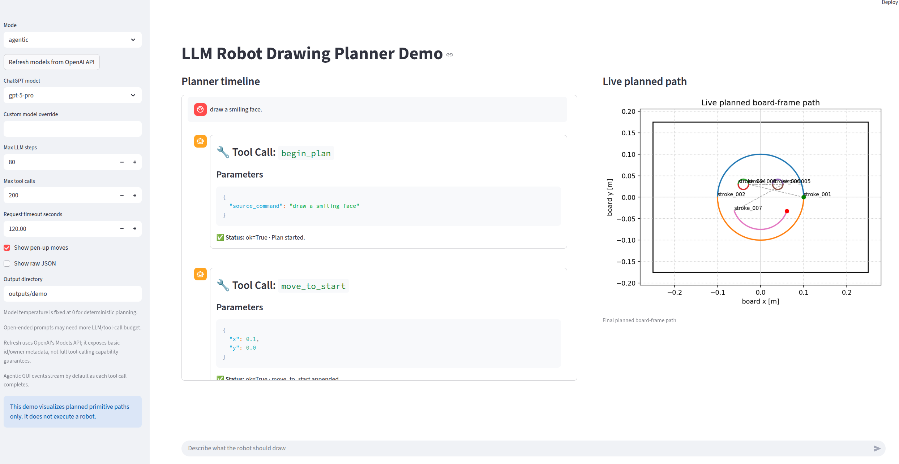

# robot_drawing_planner

<p align="center">
  
</p>

LangChain / LLM planner for **LLM-Assisted Robot Shape Drawing in Isaac Sim**.

## Project Scope

This package implements only the LangChain/LLM planner layer. The project
contribution is the **agentic planner over robot primitive actions**:

```text
natural language command
-> ChatOpenAI bound to Unit Action tools
-> multi-step tool calls
-> PlanBuilder state
-> primitive action JSON
```

It outputs robot-level primitive action JSON. It does **not** execute robot
motion or compute IK, FK, Jacobians, joint angles, joint commands, torque
commands, Isaac Sim execution, trajectories, trajectory samples, or fake robot
execution results.

This module outputs primitive action JSON only; it does not compute IK, Jacobians, joint commands, FK, or Isaac Sim execution.

The downstream robot/kinematics module owns frame transforms, trajectory
sampling, IK/Jacobian control, and Isaac Sim execution.

## Planner Modes

There are two planning paths:

- **Agentic LLM planner**: the production/default mode. The LLM is bound to
  Unit Action tools such as `move_to_start`, `pen_down`, `draw_line_to`,
  `draw_arc`, `check_plan`, and `finish_plan`. The LLM must call these tools
  step by step, and each call appends one symbolic primitive action to
  `PlanBuilder`.
- **Template baseline**: the old ParsedGoal/template compiler. It is kept for
  baseline comparisons, fallback behavior, tests, and simple demos. It extracts
  shape parameters and deterministic Python code creates the template strokes.
- **`--no-api` demo fallback**: deterministic local parsing for development and
  tests only. It does not exercise production agentic LLM tool planning.

Open-ended shapes such as a house, smiley face, or star approximation are
examples for the agentic LLM planner. They are **not** hard-coded as deterministic
geometry templates.

## Installation

```bash
python -m venv .venv
source .venv/bin/activate
pip install -e ".[dev]"
```

## API Key Setup

The live parser reads the API key from `OPENAI_API_KEY`. Do not put raw API keys
in this repository.

```bash
export OPENAI_API_KEY="..."
export OPENAI_MODEL="gpt-5-nano"
```

If `OPENAI_MODEL` is omitted, the default model is `gpt-5-nano`.

If the key is stored in `~/.zshrc`, run the CLI through zsh when needed:

```bash
zsh -ic 'robot-drawing-plan "Draw a circle with radius 5 cm" --pretty'
```

## CLI Examples

Live LangChain/OpenAI agentic Unit Action tool mode:

```bash
zsh -ic 'robot-drawing-plan "중앙에 반지름 5cm짜리 원을 그려줘" --pretty --out outputs/circle_plan.json'
```

Choose a ChatGPT/OpenAI model version and stream planner events as they happen:

```bash
zsh -ic 'robot-drawing-plan "집 모양을 그려줘" --chatgpt-version gpt-5-nano --max-tool-calls 1000 --request-timeout 120 --stream-events --pretty'
```

Open-ended prompts such as house, star, or smiley drawings may need larger
agentic budgets than simple template-like shapes:

```bash
python -m robot_drawing_planner.cli "집 모양을 그려줘" --max-llm-steps 80 --max-tool-calls 200 --pretty
```

`--stream-events` writes one line per LLM/tool event to stderr as each event
completes, while the final `DrawingPlan` JSON remains on stdout or `--out`.
`--request-timeout` is the per-LLM-request timeout in seconds. It is different
from `--max-llm-steps`, which caps LLM response calls, and
`--max-tool-calls`, which caps executed Unit Action tool calls. These budget
options apply to agentic mode; `--no-api` and template baseline mode do not use
the Unit Action tool-call loop.

Template baseline mode:

```bash
zsh -ic 'robot-drawing-plan "Draw a circle with radius 5 cm" --mode template --pretty'
```

Development/demo mode without OpenAI:

```bash
python -m robot_drawing_planner.cli "중앙에 한 변 10cm짜리 네모를 그려줘" --no-api --pretty --out examples/square_plan.json
```

Use `--out-only` to write only to a file without printing JSON to stdout.

## Visualizing An LLM-Generated Plan

Use the Matplotlib plotter to preview the planned board-frame drawing path
before robot execution. This is useful for debugging whether the LLM planned
sensible coordinates and for checking whether the planned path sits inside the
known board boundary.

Generate a plan:

```bash
python -m robot_drawing_planner.cli "중앙에 한 변 10cm짜리 네모를 그려줘" --no-api --pretty --out outputs/square_plan.json --out-only
```

Plot the plan:

```bash
python -m robot_drawing_planner.plot_cli outputs/square_plan.json --out outputs/square_plan.png
```

Or use the console script:

```bash
robot-drawing-plot outputs/square_plan.json --out outputs/square_plan.png
```

Solid strokes represent pen-down drawing paths. Optional pen-up moves are
free-space moves and are not actual drawing. Coordinates are board-frame meters.
The visualizer does not compute IK, Jacobians, joint commands, or Isaac Sim
execution.

This plot is the planned target path only. Later, an Isaac Sim actual
end-effector trace can be overlaid as a separate feature when real execution
trace data exists.

The plotter visualizes the planned primitive path only; it does not validate robot reachability or simulate execution.

## Chatbot GUI Demo

Install the package and demo dependencies:

```bash
python -m pip install -e ".[dev]"
```

Run the Streamlit chatbot demo:

```bash
streamlit run robot_drawing_planner/demo_app.py
```

If `OPENAI_API_KEY` is exported from `~/.zshrc`, run Streamlit through zsh so
the key is visible to the app:

```bash
zsh -ic 'streamlit run robot_drawing_planner/demo_app.py'
```

The demo shows:

- user message
- selectable ChatGPT/OpenAI model version and planning options
- live per-request stopwatch and final elapsed planning time
- LLM tool calls as they happen, one message per tool call
- tool results as they happen, one message per tool result
- final `DrawingPlan` JSON
- final planned-path plot

The demo does not show IK, FK, Jacobian control, torque, Isaac Sim execution,
or an actual robot trajectory. It visualizes planned board-frame primitive paths
only.

Suggested demo prompts:

- "중앙에 한 변 10cm짜리 네모를 그려줘"
- "중앙에 반지름 5cm짜리 원을 그려줘"
- "집 모양을 그려줘"
- "웃는 얼굴을 그려줘"
- "별 모양을 그려줘"

Mode behavior:

- `agentic`: uses the live ChatGPT API and Unit Action tool calls.
- `no-api`: deterministic demo/testing only; it does not call OpenAI.
- `template`: baseline ParsedGoal/template compiler mode.

The ChatGPT model selector starts with safe defaults and can refresh available
model ids from OpenAI's Models API. The Models API provides basic model metadata
such as `id`, `object`, `created`, and `owned_by`; the GUI filters that list to
planner-oriented GPT/reasoning model ids and still allows a manual custom model
override.

The GUI streams agentic tool-call events by default. Its max LLM response step
control defaults to 80, its max tool-call control defaults to 200, and both
allow values up to 1000. Its request timeout control defaults to 120 seconds and
adjusts the per-request OpenAI timeout. The screen is split into a scrollable left
chat/tool timeline and a right live plot panel; the right panel stays visible
and updates as accepted unit-action tool calls add planned strokes.

If planning fails or reaches a budget limit after producing some strokes, the
GUI labels the image as a partial preview only. A partial preview is for
debugging the LLM plan and should not be sent to the robot. The result panel
shows `diagnostics.errors`, `diagnostics.failed_calls`, and
`diagnostics.partial_preview_available` when those fields are present. Only a
plan with `diagnostics.validation_ok == true` is labeled as the final planned
board-frame path.

## Open-Ended Agentic Examples

Prompt/tool-call examples are stored in `examples/agentic_tool_calls/`:

- `square_tool_plan.json`
- `circle_tool_plan.json`
- `letter_A_tool_plan.json`
- `house_tool_plan.json`
- `smiley_tool_plan.json`
- `star_approx_tool_plan.json`

For example, a "house" can be decomposed by the LLM into:

- body: a square-like closed line contour
- roof: a triangle-like line contour
- door: a smaller line contour on the body

That decomposition is represented as Unit Action tool calls. It is not a
deterministic compiler template in `geometry.py`.

## Agentic Tool Validation

Agentic mode still outputs primitive JSON only. The Unit Action tools validate
symbolic planner state before a primitive action is appended:

- Out-of-board `move_to_start`, `draw_line_to`, and `draw_arc` calls are rejected.
- `finish_plan` requires `pen_state == "up"`; the LLM must call `pen_up` first.
- `draw_arc` requires `current_position` to match the arc start point before the
  arc action is accepted.

These checks are planner-level JSON validation only. They do not execute robot
motion and do not compute IK, FK, Jacobians, joint commands, torque commands, or
Isaac Sim execution.

## Output Schema

Shortened representative agentic output example. The exact geometry depends on
the LLM tool calls; agentic `goal.shape_type` is `custom` because agentic mode
does not use the deterministic ParsedGoal template compiler:

```json
{
  "schema_version": "1.0",
  "source_command": "Draw a circle with radius 5 cm",
  "goal": {
    "shape_type": "custom",
    "center": {"x": 0.0, "y": 0.0, "unit": "m"},
    "radius_m": null,
    "side_length_m": null,
    "size_m": 0.1,
    "orientation_rad": 0.0,
    "letter": null,
    "frame": "board",
    "assumptions": [
      "Agentic mode does not use deterministic ParsedGoal templates."
    ],
    "warnings": []
  },
  "strokes": [
    {
      "type": "arc",
      "stroke_id": "stroke_001",
      "center": {"x": 0.0, "y": 0.0, "unit": "m"},
      "radius_m": 0.05,
      "start_angle_rad": 0.0,
      "end_angle_rad": 6.283185307179586,
      "direction": "ccw"
    }
  ],
  "actions": [
    {
      "name": "move_to_start",
      "frame": "board",
      "stroke_id": "stroke_001",
      "params": {
        "target": {"x": 0.05, "y": 0.0, "z": 0.03, "unit": "m"},
        "hover_height_m": 0.03,
        "note": "free-space move; kinematics module converts board frame to base frame"
      }
    }
  ],
  "diagnostics": {
    "validation_ok": true,
    "assumptions": [],
    "warnings": [],
    "errors": [],
    "requires_robot_feasibility_check": true,
    "mode": "agentic_unit_action_tools",
    "note": "This agentic planner outputs primitive action JSON only; it does not compute IK, FK, Jacobians, joint commands, trajectory samples, or Isaac Sim commands."
  }
}
```

Primitive action names are:

- `move_to_start`: free-space move to a hover point above the first drawing point.
- `align_pen_orientation`: symbolic orientation constraint normal to the board.
- `pen_down`: approach the board drawing surface.
- `draw_line`: line segment geometry in board-frame meters.
- `draw_arc`: circular arc geometry in board-frame meters/radians.
- `pen_up`: lift the pen after a stroke or contour.

`params` contains only planner-level geometric parameters and hints. It does not
contain IK solutions, FK results, Jacobians, joint commands, robot trajectories,
trajectory samples, or Isaac Sim commands.

## Handoff To Kinematics Teammate

- Board frame coordinates are in meters.
- Board frame origin is at the board center.
- Action params use 3D board-frame targets with `z` metadata where applicable.
- The kinematics module must convert board frame coordinates to robot base frame.
- The kinematics module must handle the pen tip offset from the end-effector.
- The kinematics module must interpolate Cartesian waypoints for line and arc actions.
- The kinematics module must compute IK/Jacobian control and any robot feasibility checks.
- This planner only provides symbolic primitive actions and geometric parameters.

## Supported Shapes

- `circle`
- `square`
- `triangle`
- Letters: `A`, `H`, `L`, `T`, `O`

## Tests

Unit tests use fakes/mocks and do not require the live OpenAI API:

```bash
pytest -q
```

## Live Smoke Test

Run through zsh when `OPENAI_API_KEY` is exported in `~/.zshrc`:

```bash
zsh -ic 'robot-drawing-plan "중앙에 반지름 5cm짜리 원을 그려줘" --pretty'
```
